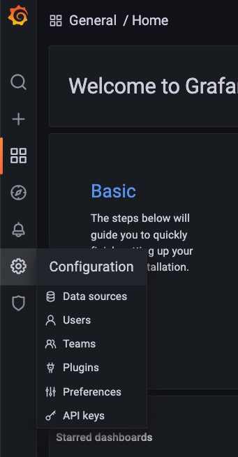
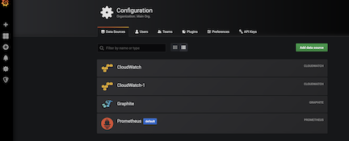
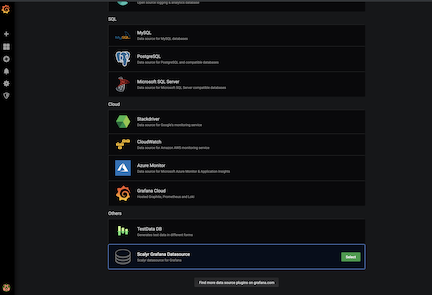
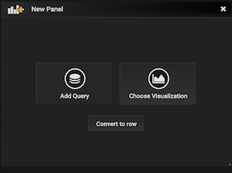
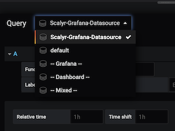
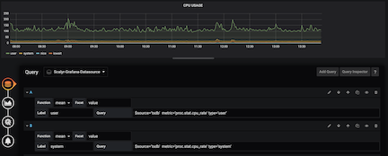

# Scalyr data source for Grafana

The Scalyr Grafana data source plugin allows existing Scalyr customers to create and visualize graphs and dashboards in Grafana using data in Scalyr. Customers can then visualize Scalyr data next to other data sources they may want to monitor on one single dashboard. 

### Prerequisites
* **An installed Grafana server instance with write access**: This document assumes that an existing instance of Grafana already exists. If you need help bringing up a Grafana instance, please refer to the documentation provided by Grafana. 
* **A Scalyr read log API Key**: a Scalyr API key is required for Grafana to pull data from Scalyr. You can obtain one by going to the Scalyr website and selecting the “API Keys” menu from the top right corner. You can find documentation [here](https://www.scalyr.com/help/api#scalyr-api-keys).


### Getting started

1. Clone the [plugin repository](https://github.com/scalyr/scalyr-grafana-datasource) from GitHub.

	```
	git  clone https://github.com/scalyr/scalyr-grafana-datasource-plugin.git
	```
2. Grafana plugins exists in directory: `/var/lib/grafana/plugins/`. Create a folder for the scalyr plugin: 

	```
	mkdir /var/lib/grafana/plugins/scalyr 
	```

3. Copy the contents of the Scalyr plugin into grafana: 

	```
	cp -r scalyr-grafana-datasource/dist/ /var/lib/grafana/plugins/scalyr/
	```

4. Adding plugins requires a restart of your grafana server. 

	For init.d based services you can use the command: 
	
	```
	sudo service grafana-server restart
	```
	
	For systemd based services you can use the following: 
	
	```
	systemctl restart grafana-server
	```

#### Verify the Plugin was Installed 

1. In order to verify proper installation you must log in to your grafana instance and navigate to **Configuration Settings -> Data Sources**. 

	

2. This will take you into the configuration page. If you already have other data sources installed, you will see them show up here. Click on the **Add data source** button:

	

3. If you scroll down on the resulting page you should see “Scalyr Grafana Datasource” show up in the “Others” section. 

	


4. Click on ***“Select”***. This will take you to a configuration page where you insert your API key mentioned in the prerequisite section. 

	

5. Enter these settings:

	|Field Name | Value|
	| --- | --- |
	|Scalyr API Key | Your Scalyr Read Logs API Key|
	|Scalyr URL | https://www.scalyr.com or https://eu.scalyr.com for EU users.|

6. Click ***Save & Test*** to verify these settings are correct. 

#### Using the Scalyr Datasource
Now that you’ve completed installing and configuring the Scalyr data source plugin, lets go through an example of how you can start using it to create a dashboard using Scalyr data. 

1. Create a new dashboard by click Create > dashboard

	

2. In the **“New Panel”** box, select the **“Add Query”** icon

	


3. From the Query dropdown, select **"Scalyr Grafana Datasource"**.

	

4. A query datasource consist of 4 parts: 
    * **Function**: You are given a list of the function that can be applied to the Facet values. You can find more documentation [here](https://www.scalyr.com/help/dashboards#graphFunctions)
    * **Facet**: The name of the event field to be graphed
    * **Label**: Label for the query. This is displayed as the series title in the graph legend.
    * **Query**: Query filter to be used. This field supports [Scalyr query syntax](https://www.scalyr.com/help/query-language).


5. Fill out all the fields and click the save button. In the image below, we’ve added a query to graph CPU Utilization. In general, if you have used graphs and dashboards within Scalyr, you should be able to port those over to grafana using the same Scalyr query syntax. 


	
	
You’ve successfully installed, configured and created a graph in Grafana using Scalyr data! 

Note: you can add multiple queries to a visualization to plot multiple series on the same graph.


#### Limitations and Future Improvements

1. Breakdown graphs are currently not supported. These may be supported in the future. 

2. Power Queries is an experimental feature and requires the user to change the visualization to a ***“table”*** inside Grafana. 

