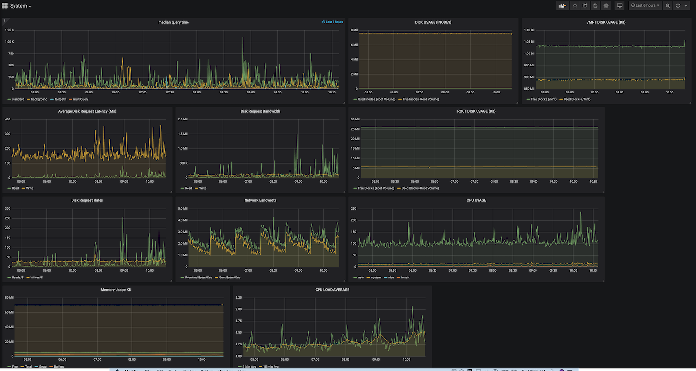
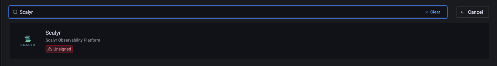
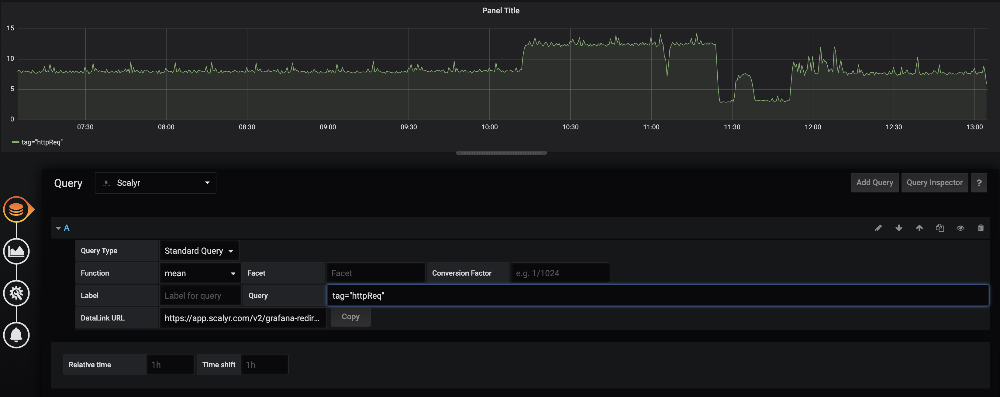
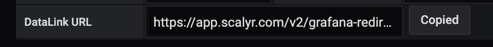
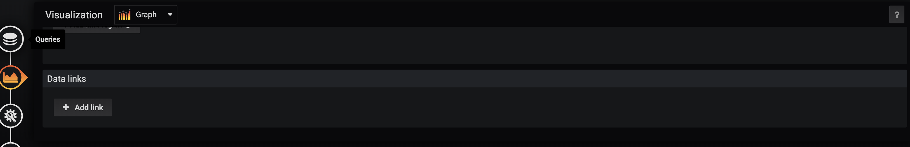
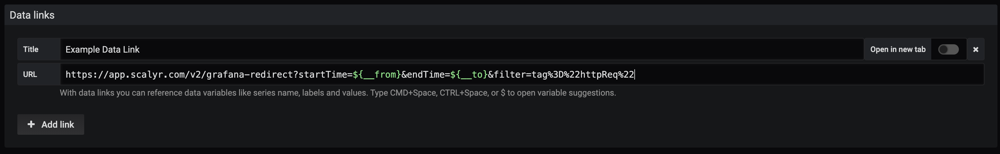
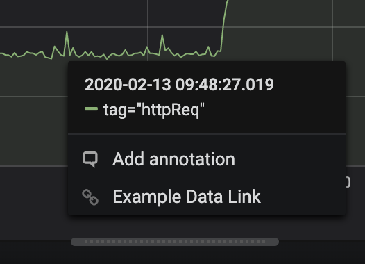

# Scalyr data source for Grafana

[](https://circleci.com/gh/scalyr/scalyr-grafana-datasource-plugin/tree/master)

The Scalyr Grafana data source plugin allows you to create and visualize graphs
and dashboards in Grafana using data in Scalyr. You may want to use this plugin
to allow you to visualize Scalyr data next to other data sources, for instance
when you want to monitor many feeds on a single dashboard.



With the Scalyr plugin, you are be able to create and visualize your log-based
metrics along side all of your other data sources. It's a great way to have a
single pane of glass for today's complex systems. You can leverage Grafana alerts
based on Scalyr data to notify you when there are possible issues. More
importantly, you'll soon be able to jump to Scalyr's fast, easy and intuitive
platform to quickly identify the underlying causes of issues that may arise.

## Prerequisites

* **An installed Grafana server instance with write access**: This document
assumes that an existing instance of Grafana already exists. If you need help
bringing up a Grafana instance, please refer to the [documentation provided by
Grafana](https://grafana.com/docs/installation/).
* **A Scalyr read log API Key**: A Scalyr API key is required for Grafana to pull
data from Scalyr. You can obtain one by going to your account in the Scalyr
product and selecting the “API Keys” from the menu in the top right corner. You
can find documentation on API Keys [here](https://www.scalyr.com/help/api#scalyr-api-keys).

## Getting started

### Installing with grafana-cli

1. To install the stable version of the plugin using grafana-cli, run the following command:

   ```bash
   grafana-cli --pluginUrl \
   https://github.com/scalyr/scalyr-grafana-datasource-plugin/releases/download/2.3.7/scalyr_grafana_plugin_51057f6.zip \
   plugins install scalyr-datasource
   ```

2. Update your Grafana configuration in the `grafana.ini` file to allow this plugin by adding the following line:

   ```bash
   allow_loading_unsigned_plugins = scalyr-datasource
   ```

3. Adding plugins requires a restart of your grafana server.

    For init.d based services you can use the command:

    ```bash
    sudo service grafana-server restart
    ```

    For systemd based services you can use the following:

    ```bash
    systemctl restart grafana-server
    ```

If you require the development version, use the manual installation instructions.

### Installing manually

1. If you want a stable version of plugin, download the desired version from
[github releases](https://github.com/scalyr/scalyr-grafana-datasource-plugin/releases).
If you want the `development` version of the plugin,
clone the [plugin repository](https://github.com/scalyr/scalyr-grafana-datasource)
from GitHub.

    ```bash
    git  clone https://github.com/scalyr/scalyr-grafana-datasource-plugin.git
    ```

2. Grafana plugins exist in the directory: `/var/lib/grafana/plugins/`. Create a folder for the scalyr plugin:

    ```bash
    mkdir /var/lib/grafana/plugins/scalyr
    ```

3. Copy the contents of the Scalyr plugin into grafana:

    Stable version:

    ```bash
    tar -xvf scalyr_grafana_plugin_51057f6.tar.gz
    cp -rf dist/ /var/lib/grafana/plugins/scalyr/
    ```

    Development version:

    ```bash
    cp -r scalyr-grafana-datasource/dist/ /var/lib/grafana/plugins/scalyr/
    ```

4. Adding plugins requires a restart of your grafana server.

    For init.d based services you can use the command:

    ```bash
    sudo service grafana-server restart
    ```

    For systemd based services you can use the following:

    ```bash
    systemctl restart grafana-server
    ```

### Verify the plugin was installed

1. In order to verify proper installation you must log in to your grafana instance
   and navigate to **Configuration Settings -> Data Sources**.

    

2. This takes you into the configuration page. If you already have other data
   sources installed, you can see them show up here. Click on the **Add data source** button:

    

3. If you enter "Scalyr" in the search bar on the resulting page you should see “Scalyr Grafana
   Datasource” show up as an option.

    

4. Click on ***“Select”***. This takes you to a configuration page where you
   insert your API key mentioned in the prerequisite section.

    

5. Enter these settings:

    |Field Name | Value|
    | --- | --- |
    |Scalyr API Key | Your Scalyr Read Logs API Key|
    |Scalyr URL | `https://www.scalyr.com` or `https://eu.scalyr.com` for EU users.|

6. Click ***Save & Test*** to verify these settings are correct.

## Using the Scalyr data source

Now that you’ve completed installing and configuring the Scalyr data source plugin,
lets go through an example of how you can start using it to create a dashboard
using Scalyr data.

1. Create a new dashboard by click Create > dashboard

    

2. In the **“New Panel”** box, select the **“Add Query”** icon

    

3. From the Query dropdown, select **"Scalyr Grafana Datasource"**.

    

4. A 'Standard query' consist of 4 parts:
    * **Function**: You are given a list of the function that can be applied to
    the field values.
    Refer to the Scalyr [graphFunctions documentation](https://www.scalyr.com/help/dashboards#graphFunctions)
    for a list of supported functions.
    * **Field**: The name of the event field to be graphed.
    * **Conversion Factor**: (Optional) Value to multiply the values of the graph, useful for converting units.
    * **Label**: (Optional) Label for the query. The graph legend displays this value as the series title. Same value
    as the `Query` field by default.
    * **Filter**: Specifies which events to match. This field supports [Scalyr query syntax](https://www.scalyr.com/help/query-language).
    * **DataLink URL**: A read-only generated field, this link can be copied to a new DataLink (at the end of the Visualization
    section). This DataLink goes to the logs in Scalyr used to create this graph.

5. Fill out all the fields and click the save button. In the image below, we’ve
   added a query to graph CPU Utilization. In general, if you have used graphs and
   dashboards within Scalyr, you should be able to port those over to grafana
   using the same Scalyr query syntax.

    

You’ve successfully installed, configured and created a graph in Grafana using Scalyr data!

> **Note**: You can add multiple queries to a visualization to plot multiple series on the same graph.

## Variables

For general information on Grafana variables refer to the [Grafana documentation](https://grafana.com/docs/grafana/latest/reference/templating/)

Queries support all Grafana variable substitution syntaxes, for example:

```bash
$varname
[[varname]]
${varname:option}
```

For multi-value variables there is a custom default substitution method, the values are quoted and separated with
commas, for example:

```bash
"value1","value2","value3"
```

The expected use of multi-value variables is for `in` queries, for example:

```bash
$serverHost=($host)
```

## DataLinks

Your queries automatically generate a URL you can use as a DataLink in Grafana,
this link takes you to the logs used to generate your graph in the Scalyr UI

   

To set up the DataLink first click `Copy` to copy the link into your clipboard

   

Next go to the **Visualization** tab and scroll down to the **Data links** section

   

Click `Add link`, give it an appropriate title, and paste your URL into the `URL` field

   

Your Data Link is now ready! If you now go to your graph and click on the line you
are shown new option, this takes you to Scalyr and show the logs your graph represents

   

> **Note**: You need to already be logged in to Scalyr for the DataLink to reach the UI,
and variables are accepted in DataLinks but there are limitations due to a
[Grafana bug](https://github.com/grafana/grafana/issues/22183)

## Limitations and future improvements

1. Breakdown graphs are currently not supported. These may be supported in the
   future.

2. Complex queries with multiple functions are currently not supported. These may
   be supported in the future.

3. The DataLinks feature currently only works for queries without variables due to
   a [Grafana bug](https://github.com/grafana/grafana/issues/22183).

## Contributing

Refer to [How to contribute?](/HOW_TO_CONTRIBUTE.md) for developer documentation.

## License

The Scalyr Grafana plugin is licensed under
[Apache License](https://www.apache.org/licenses), version 2.0. More information
is available in the [LICENSE](LICENSE) file.
